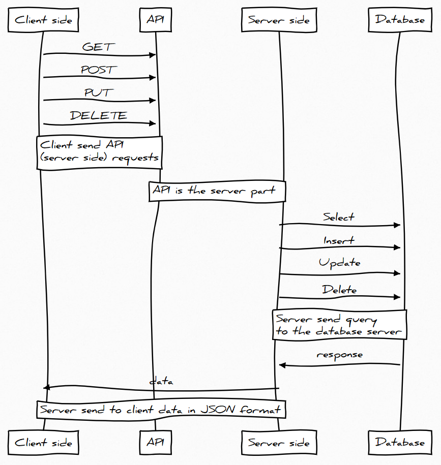

# Описание проекта

Изначальная идея проекта состояла в том, что необходимо не просто писать запросы, но и посмотреть, как именно это работает. На примере реальных задач, понять какой именно этап занимает БД в системе. Идеальным решением было бы проводить курсы БД и ПТИ (идущий в 6 семестре) в одно время. Возможно так когда-то и будет, но не сейчас.

Изучив не малое количество курсов по базам данных стало понятно, что подход к изучению отличается разительно. Например, в Бауманке студенты создают приложение средствами Oracle. Изучив этот вариант, стало понятно, что студентам придётся потратить множество времени на изучение интерфейса и вообще в целом проект там создаётся с минимум программирования, в основном тыканьем мыши. Что с реальностью имеет мало общего. Если бы такое было востребовано на рынке, то да. Но это не так, поэтому тратить на это время не целесообразно.

С другой стороны, есть вариант сделать проект, используя современные подходы, имея на руках готовый проект, с разными написанными частями. В этом варианте изучение гораздо сложнее, но для заинтересовавшихся студентов есть куда расти и каждый рассматриваемый компонент реально востребован на рынке труда. А для не заинтересовавшихся оба варианта проекта отличаться кардинально не будет. Подставить запросы туда, подставить сюда.

На картинке представлена диаграмма последовательности. Всё состоит из 3-х частей: клиентская часть, серверная и база данных. По сути, клиент взаимодействует с базой данных при помощи серверной части, на которой написан API – application programming interface.

## Структура проекта

В корне файлы:

-   .editorconfig - настройки редактора
-   .prettierrc.js - настройки расширения prettier
-   README.md - описание проекта

Папки:

-   client - клиентская часть
-   server - серверная часть

### server

На серверной части в нашем случае должны быть написаны API. Готовые запросы для взаимодействия с базой данных. **Будьте внимательный:** всё-таки это учебный проект, некоторые моменты тут не рассматриваются, безопасности приложения полноценное внимание не уделяется. Например, хранить прям в коде (или отдельных файлах) пароли, секретный ключи и прочую информацию **категорически запрещается**. Думаю, тут понятно. Мы не хотим предоставить доступа тому, у кого его быть не должно. Тестирование, deploy приложения и многое многое другое тут не будет рассматриваться, т.к. не относится к основной задаче курса.

Это больше экспериментальный вариант подачи материала по курсу БД, который должен принести больше понимания в общем смысле.

### client

С клиентской частью в проекте несколько сложнее. Начинать изучение с того, что будет использоваться в нём нерационально. Необходимо начинать с основ. Их изучением вы будете заниматься на других курсах. В этом для нас интересно только одно - посмотреть на готовый результат, а использовать наше API вместе с современными подходами к frontend разработке гораздо проще.

Т.е. вам совершенно не обязательно читать и вникать в нюансы, тут будет необходимый минимум для всех, но также и описание для тех, кто желает углубиться в изучение сильнее.

**Не забывайте**, что IT-сфера развивается очень быстро и если вы планируете связать свою дальнейшую жизнь с программированием, то учиться придётся всегда, самостоятельно разбираться в материале.
