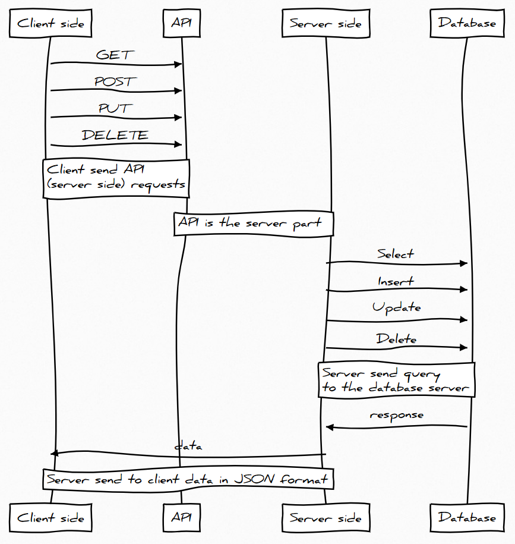
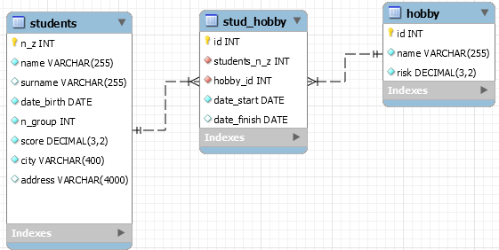

# Описание проекта

Изначальная идея проекта состояла в том, что необходимо не просто писать запросы, но и посмотреть, как именно это работает. На примере реальных задач, понять какой именно этап занимает БД в системе. Идеальным решением было бы проводить курсы БД и ПТИ (идущий в 6 семестре) в одно время. Возможно так когда-то и будет, но не сейчас.

Изучив не малое количество курсов по базам данных стало понятно, что подход к изучению отличается разительно. Например, в Бауманке студенты создают приложение средствами Oracle. Изучив этот вариант, стало понятно, что студентам придётся потратить множество времени на изучение интерфейса и вообще в целом проект там создаётся с минимум программирования, в основном тыканьем мыши. Что с реальностью имеет мало общего. Если бы такое было востребовано на рынке, то да. Но это не так, поэтому тратить на это время не целесообразно.

С другой стороны, есть вариант сделать проект, используя современные подходы, имея на руках готовый проект, с разными написанными частями. В этом варианте изучение гораздо сложнее, но для заинтересовавшихся студентов есть куда расти и каждый рассматриваемый компонент реально востребован на рынке труда. А для не заинтересовавшихся оба варианта проекта отличаться кардинально не будет. Подставить запросы туда, подставить сюда.



На картинке представлена диаграмма последовательности. Всё состоит из 3-х частей: клиентская часть, серверная и база данных. По сути, клиент взаимодействует с базой данных при помощи серверной части, на которой написан API – application programming interface.

## Структура проекта

В корне файлы:

-   .editorconfig - настройки редактора
-   .prettierrc.js - настройки расширения prettier
-   README.md - описание проекта
-   studhobby.mwb - схема стартовой БД в mysql workbench

Папки:

-   client - клиентская часть
-   server - серверная часть

### server

На серверной части в нашем случае должны быть написаны API. Готовые запросы для взаимодействия с базой данных. **Будьте внимательны:** всё-таки это учебный проект, некоторые моменты тут не рассматриваются, безопасности приложения полноценное внимание не уделяется. Например, хранить прям в коде (или отдельных файлах) пароли, секретный ключи и прочую информацию **категорически запрещается**. Думаю, тут понятно. Мы не хотим предоставить доступа тому, у кого его быть не должно. Тестирование, deploy приложения и многое многое другое тут не будет рассматриваться, т.к. не относится к основной задаче курса.

Это больше экспериментальный вариант подачи материала по курсу БД, который должен принести больше понимания в общем смысле.

### client

С клиентской частью в проекте несколько сложнее. Начинать изучение с того, что будет использоваться в нём нерационально. Необходимо начинать с основ. Их изучением вы будете заниматься на других курсах. В этом для нас интересно только одно - посмотреть на готовый результат, а использовать наше API вместе с современными подходами к frontend разработке гораздо проще.

Т.е. вам совершенно не обязательно читать и вникать в нюансы, тут будет необходимый минимум для всех, но также и описание для тех, кто желает углубиться в изучение сильнее.

**Не забывайте**, что IT-сфера развивается очень быстро и если вы планируете связать свою дальнейшую жизнь с программированием, то учиться придётся всегда, самостоятельно разбираться в материале.

[Ознакомиться с туториалом](./tutorial)

Задание: каждому студенту выдаётся индивидуальное задание с проектированием и запросами, которые необходимо сделать. Успешно выполненная первая часть - примерно 60% от всех баллов за проект (кроме 10 баллов, которые положены по правилам за индивидуальный проект, в него могут войти и несколько баллов с семинарских занятий). Вторая часть проекта - создание API (30%) и интерфейса для взаимодействия с API (10%).

Примерный путь выполнения проекта выглядит так:

1. Несколько пар - изучение нового материала, выполнение домашних и семинарских заданий, сдача их.
2. Создание репозитория на github, куда вы должны выкладывать выполненный по проекту прогресс (проектирование, запрос и т.д.) и в настройках (settings) добавить collaborators - RyabovNick
3. Получение варианта для индивидуального задания - он выдаётся не всем, необходимо набрать некоторое количество баллов.
4. Продолжение изучение нового материала, выполнение домашних и семинарских занятий, а также параллельное начало выполнения индивидуального проекта (т.е. вы его получитите раньше, чем полученные знания позволяет вам его выполнить)
5. Проектирование базы данных
6. Заполнение базы данных данными для тестирования
7. Написание необходимых запросов по заданию
8. Написание API: по сути просто использовать ранее написанные запросы
9. Клентская часть: по сути просто копирование ссылок с API

По 1-7 пункту материал будет рассказан на семинаре и он весь присутствует в [основном репозитории](https://github.com/RyabovNick/databasecourse2019)

По 8-9 пунктам материал и объяснение будет в этом репозитории.

Будет использоваться база данных, с которой мы и начнём знакомство в этом семестре - студенты-хобби.



Необходимо выполнить несколько следующих запросов:

1. Вывести всех студентов
2. Вывести всю информацию о студенте с заданным номером зачётки
3. Вывести студентов заданного города
4. Добавить нового студента
5. Изменить информацию о студенте с заданным номером зачётки
6. Удалить студентам с заданным номером зачётки

Тут 6 простейших запросов - 3 на Select, по 1 на Insert, Update, Delete

```sql
Select *
from students
```

Следующие запросы имеют входные параметры. В oracle, например можно сделать таким образом :param - двоеточие означает, что это параметр с названием, которое следует за ним. Либо можно сразу подставить в запрос нужное нам значение. А в node.js используется ? (или в некоторых случаях ??) для [экранирования](https://github.com/RyabovNick/databasecourse2019/tree/master/Theory/7_SQL_injection)

```sql
Select *
from students
where n_z = ?
```

```sql
Select *
from students
where city = ?
```

Обратите внимание на запрос с добавлением: мы указываем все атрибуты, кроме `n_z` - это уникальный атрибут и мы оставляем задачу его определения на стороне СУБД - у нас будет автоматически номер зачётки с каждым добавленным увеличиваться на 1.

```sql
INSERT INTO students(name, surname, date_birth, n_group, score, city, address)
VALUES (?,
        ?,
        ?,
        ?,
        ?,
        ?,
        ?)
```

Запрос на обновление. Будьте внимательны, тут пример для mysql. И мы используем функцию `IFNULL`, которая проверяет 1-ый атрибут (входной параметр), если он не `null`, то указанный атрибут (например, `name` будет равен значению входного параметра). Если входной равен `null`, то `name` = name. Т.е. мы не будем изменять.

Зачем это делать? Тогда при изменении каких-то атрибутов нам придётся указывать их все обязательно. Либо делать куча API для каждой ситуации.

В oracle функции отличаются. Для нашей задачи подойдёт `nvl` - работает аналогично.

```sql
UPDATE students
SET name = IFNULL(?, name),
    surname = IFNULL(?, surname),
    date_birth = IFNULL(?, date_birth),
    n_group = IFNULL(?, n_group),
    score = IFNULL(?, score),
    city = IFNULL(?, city),
    address = IFNULL(?, address)
WHERE n_z = ?
```

```sql
DELETE
FROM students
WHERE n_z = ?
```

Ну и ещё один запрос на несколько таблиц:  
Вывести всех студентов, которые когда-либо занимались или занимаются хобби

```sql
SELECT s.*
FROM students s,
     stud_hobby sh
WHERE s.n_z = sh.n_z;
```
