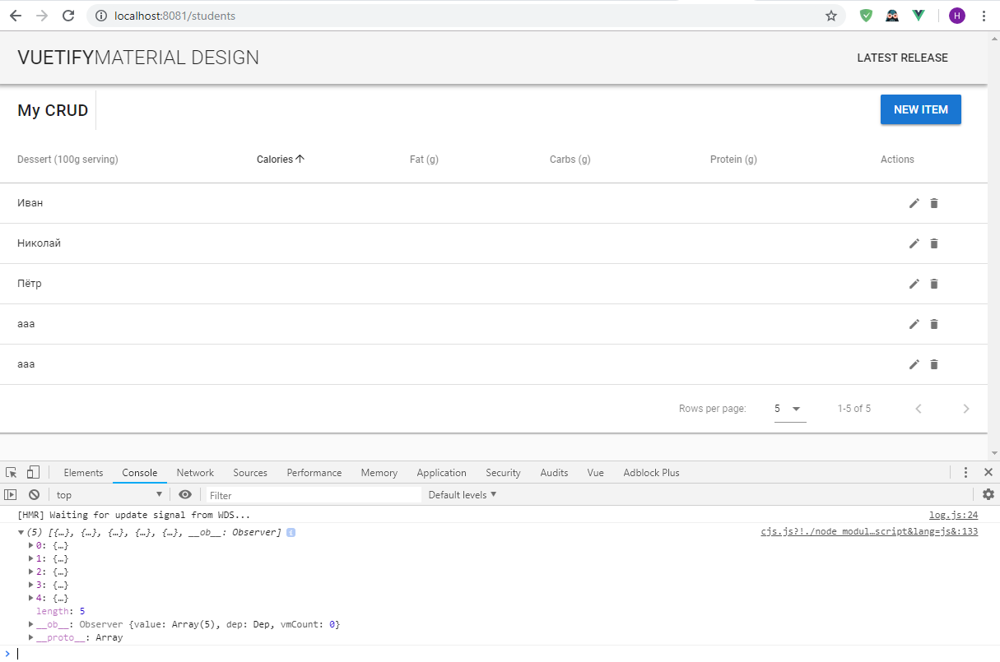
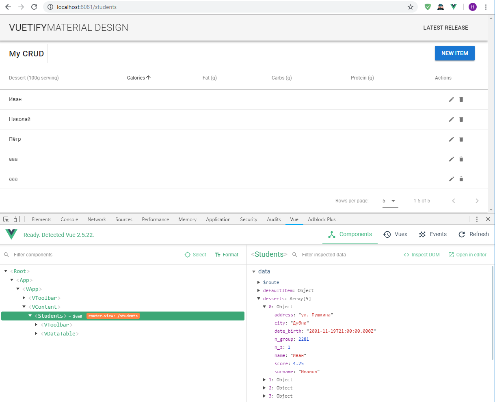
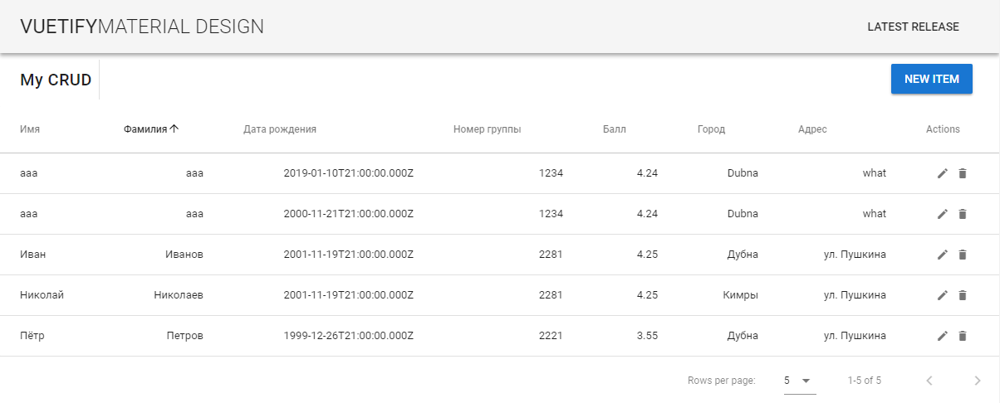
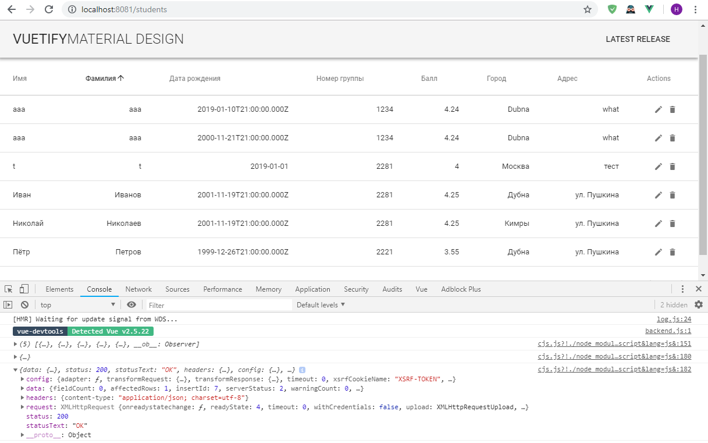

# Tutorial

На этом этапе проекта у вас должна быть серверная часть, в которой реализованы API взаимодействия с БД.

Если мы просто перейдём по ссылке, то получим данные в JSON формате. Или с использованием REST Client мы можем отправить post, put, delete запрос который сделает какую-то работу. Но, понятное дело, это не удобно. Нам нужен какой-то интерфейс взаимодействия с нашим API.

Лучшим вариантом будет сделать fork репозитория и вносить изменения в готовы, либо склонировать его.

Но и конечно, можно начать с нуля.

Точнее, не совсем с нуля, используя [vue-cli](https://cli.vuejs.org/)

Инструкция по использованию [тут](https://cli.vuejs.org/guide/installation.html)

`npm install -g @vue/cli` установит глобально, т.е. оно будет доступно отовсюду.

[Создание проекта](https://cli.vuejs.org/guide/creating-a-project.html#vue-create)

`vue create client` - создаст новый проект. Там будет задано несколько вопросов. Можно выбирать всё по умолчанию.

Т.к. в вёрстку мы не сильно хотим углубляться (но немного затронуть придётся, конечно) удобно использовать готовые компоненты, например [Vuetify](https://vuetifyjs.com)

[Инструкция](https://vuetifyjs.com/en/getting-started/quick-start)

в терминале `cd client` и затем

`vue add vuetify` добавит в ваш проект этот пакет

для удобного управления ссылками нашего приложения лучше использовать [VueRouter](https://router.vuejs.org/installation.html#npm)

`npm install vue-router`

Главный файл - `main.js`, в котором подключается сам Vue, Vuetify и прочие библиотеки. А также файл App.vue - с стартовым шаблоном & router - ссылки приложения.

В router подключается VueRouter и файл routes - в котором содержатся все пути (для удобства, это вынесено в отдельный файл)

```js
let router = new VueRouter({
    mode: 'history',
    routes
})
```

mode - по умолчанию используется hash - тогда в адресной строке будет #. Мы поменяем на history, чтобы путь был чистый. Но обратите внимание, если будете разворачивать приложение где-то на сервере, скорее всего придётся ещё внести изменения в настройку веб-серверва (apache, nginx, iis) чтобы при обновлении (на f5) приложение продолжало работать. Эта проблема достаточно легко гуглится.

`routes.js`

```js
import Home from './components/HelloWorld.vue'
import Students from './components/Students.vue'

export const routes = [
    { path: '/', name: 'Home', component: Home },
    { path: '/students', name: 'Students', component: Students }
]
```

ещё для удобства работы с API поставим `axios`

`npm install axios`

и в `main.js` добавим

```js
import axios from 'axios'

Vue.prototype.$http = axios
```

Подключаем два компонента (которые сделаем позже (HelloWorld создаётся вместе с проектом)) и добавим ещё один путь - students

Ну и нам осталось сделать собственно компонент `Students.vue`

Т.к. мы не хотим долго разбираться, но хотим, чтобы сразу было красиво, то используем готовый компонент `Vuetify` - [CRUD actions](https://vuetifyjs.com/en/components/data-tables#crud-actions)

На этой страничке у нас должна быть возможность получить всех студентов, добавить нового, изменить, удалить.

Создадим новый компонент, просто файл с расширением .vue (Students.vue) в папке components

и давайте для начала туда добавим прям всё, что в `vuetify` указано в качестве примера и разберём его (в один файл - всё из template и всё из script).

Находясь в папке client в терминале введём `npm run server`, чтобы запустить приложение. И перейдём по ссылке (`localhost:8080`). Попробуем перейти по http://localhost:8080/students и получим в результате тоже, что и по основной ссылке. Это потому, что у нас прямо прописан html код страницы. Откроем App.vue и поменяем код на следующий

```html
<template>
    <v-app>
        <v-toolbar app>
            <v-toolbar-title class="headline text-uppercase">
                <span>Vuetify</span> <span class="font-weight-light">MATERIAL DESIGN</span>
            </v-toolbar-title>
            <v-spacer></v-spacer>
            <v-btn flat href="https://github.com/vuetifyjs/vuetify/releases/latest" target="_blank">
                <span class="mr-2">Latest Release</span>
            </v-btn>
        </v-toolbar>

        <v-content> <router-view /> </v-content>
    </v-app>
</template>

<script>
    export default {
        name: 'App',
        data() {
            return {
                //
            }
        }
    }
</script>
```

мы не подключаем тут компонент HelloWorld, а в v-content мы добавили `<router-view/>` именно в это место будет подставляться тот компонент, который должен использоваться по этой ссылке. Сохраним и приложение должно перекомпилироваться. Попробуем заново! Сработало. У нас всё выглядит также, как в примере vuetify.

Vue - это SPA - single page application. Приложение, в котором обновляется только необходимый контент на странице.

Давайте немного разберёмся в коде, который скопировали с vuetify. Нам его надо переделать под наши нужды.

Лучше первым делом посмотреть на секцию script, а затем на template

```html
<template>
    <div>
        <v-toolbar flat color="white">
            <v-toolbar-title>My CRUD</v-toolbar-title>
            <v-divider class="mx-2" inset vertical></v-divider>
            <v-spacer></v-spacer>
            <!--Компонент диалог
            v-model - как раз переменная из data
            -->
            <v-dialog v-model="dialog" max-width="500px">
                <v-btn slot="activator" color="primary" dark class="mb-2">New Item</v-btn>
                <v-card>
                    <!--formTitle computed метод, которые возвращает
                    значение в зависимости от того, что мы будем делать
                    (изменять или добавлять)-->
                    <v-card-title> <span class="headline">{{ formTitle }}</span> </v-card-title>

                    <v-card-text>
                        <v-container grid-list-md>
                            <v-layout wrap>
                                <!--
                                    тут создаются текстовые поля
                                    v-model - присваивается одно значение
                                    из editedItem
                                -->
                                <v-flex xs12 sm6 md4>
                                    <v-text-field
                                        v-model="editedItem.name"
                                        label="Dessert name"
                                    ></v-text-field>
                                </v-flex>
                                <v-flex xs12 sm6 md4>
                                    <v-text-field
                                        v-model="editedItem.calories"
                                        label="Calories"
                                    ></v-text-field>
                                </v-flex>
                                <v-flex xs12 sm6 md4>
                                    <v-text-field
                                        v-model="editedItem.fat"
                                        label="Fat (g)"
                                    ></v-text-field>
                                </v-flex>
                                <v-flex xs12 sm6 md4>
                                    <v-text-field
                                        v-model="editedItem.carbs"
                                        label="Carbs (g)"
                                    ></v-text-field>
                                </v-flex>
                                <v-flex xs12 sm6 md4>
                                    <v-text-field
                                        v-model="editedItem.protein"
                                        label="Protein (g)"
                                    ></v-text-field>
                                </v-flex>
                            </v-layout>
                        </v-container>
                    </v-card-text>

                    <!--
                    Кнопки сохранения или закрытия.
                    На них повешен метод @click - save & close
                    -->
                    <v-card-actions>
                        <v-spacer></v-spacer>
                        <v-btn color="blue darken-1" flat @click="close">Cancel</v-btn>
                        <v-btn color="blue darken-1" flat @click="save">Save</v-btn>
                    </v-card-actions>
                </v-card>
            </v-dialog>
        </v-toolbar>
        <!--
        Таблица.
        Заголовки берём из переменной headers
        Значения берём из переменной desserts
        И указываем как их будем выводить
        -->
        <v-data-table :headers="headers" :items="desserts" class="elevation-1">
            <template slot="items" slot-scope="props">
                <td>{{ props.item.name }}</td>
                <td class="text-xs-right">{{ props.item.calories }}</td>
                <td class="text-xs-right">{{ props.item.fat }}</td>
                <td class="text-xs-right">{{ props.item.carbs }}</td>
                <td class="text-xs-right">{{ props.item.protein }}</td>
                <td class="justify-center layout px-0">
                    <v-icon small class="mr-2" @click="editItem(props.item)"> edit </v-icon>
                    <v-icon small @click="deleteItem(props.item)"> delete </v-icon>
                </td>
            </template>
            <template slot="no-data">
                <v-btn color="primary" @click="initialize">Reset</v-btn>
            </template>
        </v-data-table>
    </div>
</template>

<script>
    export default {
        /*
        https://vuejs.org/v2/api/#Options-Data
        Более подробно можно почитать по ссылке. Там кстати есть перевод.
        По сути, vue связывает данные тут с переменной в шаблоне
        и делает "реактивное" изменение. Т.е. как только тут что-то
        поменялось, такие же изменения будут внесены в шаблоне

        В нашем случае мы храним значение переменной dialog
        (открыто или закрыто окно диалога)
        - текст заголовков таблицы
        - массив десертов
        - editedIndex - меняем или добавляем новое?
        - editedItem - здесь будут присваиватся значения изменяемого объекта
        - defaultItem - значения по умолчанию
        */
        data: () => ({
            dialog: false,
            headers: [
                {
                    text: 'Dessert (100g serving)',
                    align: 'left',
                    sortable: false,
                    value: 'name'
                },
                { text: 'Calories', value: 'calories' },
                { text: 'Fat (g)', value: 'fat' },
                { text: 'Carbs (g)', value: 'carbs' },
                { text: 'Protein (g)', value: 'protein' },
                { text: 'Actions', value: 'name', sortable: false }
            ],
            desserts: [],
            editedIndex: -1,
            editedItem: {
                name: '',
                calories: 0,
                fat: 0,
                carbs: 0,
                protein: 0
            },
            defaultItem: {
                name: '',
                calories: 0,
                fat: 0,
                carbs: 0,
                protein: 0
            }
        }),

        /*
        https://vuejs.org/v2/api/#computed
        вычисляемые свойства, которые будут использоваться в шаблоне

        У нас меняется текст заголовка диалога в зависимости от переменной editedIndex
        */
        computed: {
            formTitle() {
                return this.editedIndex === -1 ? 'New Item' : 'Edit Item'
            }
        },

        /*
        https://vuejs.org/v2/api/#watch
        объекты для наблюдения
        val - новое значение
        */
        watch: {
            dialog(val) {
                val || this.close()
            }
        },

        /*
        https://vuejs.org/v2/api/#created
        Вызывается сразу после создания экземпляра
        относится к хукам жизненного цикла

        В этом примере вызывается метод, который добавляет значения десертов
        */
        created() {
            this.initialize()
        },

        /*
        https://vuejs.org/v2/api/#methods
        методы, которые можно запускать из шаблона
        */
        methods: {
            initialize() {
                this.desserts = [
                    {
                        name: 'Frozen Yogurt',
                        calories: 159,
                        fat: 6.0,
                        carbs: 24,
                        protein: 4.0
                    },
                    {
                        name: 'Ice cream sandwich',
                        calories: 237,
                        fat: 9.0,
                        carbs: 37,
                        protein: 4.3
                    },
                    {
                        name: 'Eclair',
                        calories: 262,
                        fat: 16.0,
                        carbs: 23,
                        protein: 6.0
                    },
                    {
                        name: 'Cupcake',
                        calories: 305,
                        fat: 3.7,
                        carbs: 67,
                        protein: 4.3
                    },
                    {
                        name: 'Gingerbread',
                        calories: 356,
                        fat: 16.0,
                        carbs: 49,
                        protein: 3.9
                    },
                    {
                        name: 'Jelly bean',
                        calories: 375,
                        fat: 0.0,
                        carbs: 94,
                        protein: 0.0
                    },
                    {
                        name: 'Lollipop',
                        calories: 392,
                        fat: 0.2,
                        carbs: 98,
                        protein: 0
                    },
                    {
                        name: 'Honeycomb',
                        calories: 408,
                        fat: 3.2,
                        carbs: 87,
                        protein: 6.5
                    },
                    {
                        name: 'Donut',
                        calories: 452,
                        fat: 25.0,
                        carbs: 51,
                        protein: 4.9
                    },
                    {
                        name: 'KitKat',
                        calories: 518,
                        fat: 26.0,
                        carbs: 65,
                        protein: 7
                    }
                ]
            },

            /*
            добавляет в окно диалога значения конкретного элемента
            */
            editItem(item) {
                this.editedIndex = this.desserts.indexOf(item)
                this.editedItem = Object.assign({}, item)
                this.dialog = true
            },
            /*
            удаляет элемент из массива
            */
            deleteItem(item) {
                const index = this.desserts.indexOf(item)
                confirm('Are you sure you want to delete this item?') &&
                    this.desserts.splice(index, 1)
            },
            /*
            закрывает окно диалога и из переменную с значениями изменяемого элемента возвращает к значениям по умолчанию
            */
            close() {
                this.dialog = false
                setTimeout(() => {
                    this.editedItem = Object.assign({}, this.defaultItem)
                    this.editedIndex = -1
                }, 300)
            },
            /*
            то, что произойдёт по нажатию на кнопку сохранение
            идёт проверка мы изменяем или добавляем новый
            У нас всё надо будет связать с API!
            */
            save() {
                if (this.editedIndex > -1) {
                    Object.assign(this.desserts[this.editedIndex], this.editedItem)
                } else {
                    this.desserts.push(this.editedItem)
                }
                this.close()
            }
        }
    }
</script>
```

Итак, логика работы компонента на данный момент немного должна быть понятна.

Что мы хотим сделать?

Вывести всех студентов (а не десерты). Дать возможность изменять, удалять, добавлять.

Пример выше нигде не сохраняет ничего. Вы поменяли, обновили страницу (на f5) и все значения будут по умолчанию. Конечно, мы этого не хотим. Именно поэтому у нас в первую очередь было сделано API.

Поэтому при создании экземляра мы должны в `this.desserts` не добавить какие-то прибитые гвоздями значения, а достать их из БД.

Для удобства будем использовать axios, который мы установили ранее.

и нам его надо добавить в самое начало секции script

```js
<script>
import axios from 'axios'

...
```

Нам необходимо получить из API все данные.
Вот таким образом, console.log для удобства, чтобы увидеть в консоли, что данные мы получили все, т.к. они появятся не полностью.

Пример данных:

```json
[
    {
        "n_z": 1,
        "name": "Иван",
        "surname": "Иванов",
        "date_birth": "2001-11-19T21:00:00.000Z",
        "n_group": 2281,
        "score": 4.25,
        "city": "Дубна",
        "address": "ул. Пушкина"
    },
    {
        "n_z": 2,
        "name": "Николай",
        "surname": "Николаев",
        "date_birth": "2001-11-19T21:00:00.000Z",
        "n_group": 2281,
        "score": 4.25,
        "city": "Кимры",
        "address": "ул. Пушкина"
    },
    {
        "n_z": 3,
        "name": "Пётр",
        "surname": "Петров",
        "date_birth": "1999-12-26T21:00:00.000Z",
        "n_group": 2221,
        "score": 3.55,
        "city": "Дубна",
        "address": "ул. Пушкина"
    },
    {
        "n_z": 5,
        "name": "aaa",
        "surname": "aaa",
        "date_birth": "2019-01-10T21:00:00.000Z",
        "n_group": 1234,
        "score": 4.24,
        "city": "Dubna",
        "address": "what"
    },
    {
        "n_z": 6,
        "name": "aaa",
        "surname": "aaa",
        "date_birth": "2000-11-21T21:00:00.000Z",
        "n_group": 1234,
        "score": 4.24,
        "city": "Dubna",
        "address": "what"
    }
]
```

```js
initialize() {
    axios
    .get('http://localhost:8080/api/students')
    .then(response => {
        this.desserts = response.data
        console.log(this.desserts)
    })
    .catch(error => {
        console.log(error)
    })
}
```

После выполнения вы должны получить на странице примерно такое:



консоль снизу открывается по нажатию на F12.

Кстати, на скриншоте можете увидеть расширение для vue.js - [Vue.js devtools](https://chrome.google.com/webstore/detail/vuejs-devtools/nhdogjmejiglipccpnnnanhbledajbpd?hl=en)

Можно поставить для удобства



Прокомментируем код выше.

Мы используем подключенный пакет axios с встроенным методом - get, который открывается по ссылке. Напомню, что эта ссылка - на серверную часть, у вас она должна быть запущена (мы делали это в первую очередь)

Затем используется такая конструкция, как Promise.

.then - если выполнилось хорошо
.catch - если ошибка

Если выполнилось, то в переменную, которую мы назвали response будет положен весь ответ от сервера (можете сделать `console.log(response)` и посмотреть, что ещё он возвращает)

Мы берём только данные, которые хранятся в data (`response.data`) и кладём их в переменную this.desserts.

Как видно на скриншоте и должно получиться у вас - мы видим только имя, потому что оно совпало с тем, что у нас было в dessert (name - name)

Остальные мы не видим, т.к. хотим вывести calories, fat и т.д., но таких атрибутов у нас нет. Надо это поправить.

Во-первых давайте все desserts переименуем в students

Поменяем переменную `headers`

```js
headers: [
    {
        text: 'Имя',
        align: 'left',
        sortable: false,
        value: 'name'
    },
    { text: 'Фамилия', value: 'surname' },
    { text: 'Дата рождения', value: 'date_birth' },
    { text: 'Номер группы', value: 'n_group' },
    { text: 'Балл', value: 'score' },
    { text: 'Город', value: 'city' },
    { text: 'Адрес', value: 'address' },
    { text: 'Actions', value: 'name', sortable: false }
]
```

а также editedItem & defaultItem

```js
    editedItem: {
      name: '',
      surname: '',
      date_birth: '',
      n_group: 0,
      score: 0,
      city: '',
      address: ''
    },
    defaultItem: {
      name: '',
      surname: '',
      date_birth: '',
      n_group: 0,
      score: 0,
      city: '',
      address: ''
    }
```

Теперь займёмся шаблоном.

Понятно, что количество столбцов выросло, нам надо это поправить.

Займёмся компонентом `v-data-table`

```html
<td>{{ props.item.name }}</td>
<td class="text-xs-right">{{ props.item.surname }}</td>
<td class="text-xs-right">{{ props.item.date_birth }}</td>
<td class="text-xs-right">{{ props.item.n_group }}</td>
<td class="text-xs-right">{{ props.item.score }}</td>
<td class="text-xs-right">{{ props.item.city }}</td>
<td class="text-xs-right">{{ props.item.address }}</td>
```

Мы добавили туда 2 атрибута и поменяли названия на правильные. И вуаля, посмотрим на таблицу:



Итак, у нас тут выведены все данные, работает сортировка.

Т.е. мы полностью сделали часть с получением данных.

Теперь добавления, изменения и удаления.

## Добавление

Итак, алгоритм такой - мы жмём на кнопку, появляется окно со всеми полями, мы их заполняем, жмём сохранить. Запись добавляет в БД и в переменную this.students (если она точно добавилась в БД, чтобы пользователь сразу понял, что всё ок. И в тоже время, чтобы не случилось такого, что данные появились в таблице, но во время записи в БД ошибка).

Начнём с шаблона и компонента внутри него - `v-card-text`

```html
<v-card-text>
    <v-container grid-list-md>
        <v-layout wrap>
            <v-flex xs12 sm6 md4>
                <v-text-field v-model="editedItem.name" label="Имя"></v-text-field>
            </v-flex>
            <v-flex xs12 sm6 md4>
                <v-text-field v-model="editedItem.surname" label="Фамилия"></v-text-field>
            </v-flex>
            <v-flex xs12 sm6 md4>
                <v-text-field v-model="editedItem.date_birth" label="Дата рождения"></v-text-field>
            </v-flex>
            <v-flex xs12 sm6 md4>
                <v-text-field v-model="editedItem.n_group" label="Номер группы"></v-text-field>
            </v-flex>
            <v-flex xs12 sm6 md4>
                <v-text-field v-model="editedItem.score" label="Средний балл"></v-text-field>
            </v-flex>
            <v-flex xs12 sm6 md4>
                <v-text-field v-model="editedItem.city" label="Город"></v-text-field>
            </v-flex>
            <v-flex xs12 sm6 md4>
                <v-text-field v-model="editedItem.address" label="Адрес"></v-text-field>
            </v-flex>
        </v-layout>
    </v-container>
</v-card-text>
```

Итак, в скрипте нам надо работать с методом save

```js
save() {
    if (this.editedIndex > -1) {
        Object.assign(this.desserts[this.editedIndex], this.editedItem)
    } else {
        this.desserts.push(this.editedItem)
    }
    this.close()
}
```

Итак, если это добавление элементов, то процедура добавление отправит нас в `else { ... }`

Там мы тоже воспользуемся для удобства `axios`

Для добавления у нас метод POST - напомню, мы написали уже API. По точно такой же ссылке, как и get - `http://localhost:8080/api/students`. Только 2-ым параметром нам надо передать переменную с данными в JSON формате - это `editedItem`.

Дальше в случае успешного выполнения - добавим этот же элемент в массив элементов на странице. Т.е. мы не выполняем заново запрос к таблице, чтобы получить весь список. Мы знаем, что элемент уже там, зачем нам нагружать БД ещё раз.

Ну и также обработаем ошибку. С ошибками мы особо не разбираемся - это не вариант применения на практике, но для нас хорошо.

```js
console.log(this.editedItem)
axios
    .post('http://localhost:8080/api/students', this.editedItem)
    .then(response => {
        console.log(response)
        this.students.push(this.editedItem)
    })
    .catch(error => {
        console.log('error: ', error)
        throw error
    })
```

Сохраните и попробуйте что-то добавить. Вуаля!



## Изменение

Тут по аналогии с добавлением. Мы правим тот же метод `save()`, только уже когда `this.editedIndex > -1`

С update есть одна особенность. Помните как выгляди адрес API?

`/students/:n_z` - т.е. нам надо передать ещё и `n_z`. Не проблема!

Мы будем отправлять таким образом:

```js
;`http://localhost:8080/api/students/${this.editedItem.n_z}`
```

Если мы ставим \` такие кавычки, то можем удобным образом вставлять значения переменных в текст при помощи конструкции `${}`

Итак, полный код будет выглядеть таким образом:

```js
console.log(this.editedItem)
axios
    .put(`http://localhost:8080/api/students/${this.editedItem.n_z}`, this.editedItem)
    .then(response => {
        console.log(response)
        Object.assign(this.students[this.editedIndex], this.editedItem)
    })
    .catch(error => {
        throw error
    })
```

Но, к сожалению, тут есть несколько проблем.

Если вы попробуете изменить просто имя, то возникнет проблема - сервер упадёт из-за даты, которую мы пытаемся запихнуть в БД, т.к. у нас она хранится другим образом. Это всё стандартное отображение. Пофиксим это чуть позже, пока просто уберите лишнее из даты и имя, сохраните (не забудьте заново запустить сервер, если он упал)

Всё сработало, в базу внеслись изменения!

Только в консоли может появиться подобное сообщение:

```js
Uncaught (in promise) TypeError: Cannot convert undefined or null to object
    at assign (<anonymous>)
    at eval (VM19013 Students.vue:182)
```

Он ругается на эту строчку:

`Object.assign(this.students[this.editedIndex], this.editedItem)`

Ошибка может возникать не всегда. Но у точно есть одна проблема:

Добавьте новый элемент и не обновляя страницы сразу попробуйте его поменять. Не получится, т.к. n_z не известен (он генерится на сервере, он определяется автоматически)

Давайте исправим это.

Нам надо вернуться к коду с добавлением новой строки.

```js
console.log(this.editedItem)
axios
    .post('http://localhost:8080/api/students', this.editedItem)
    .then(response => {
        console.log(response)
        this.editedItem.n_z = response.data.insertId
        this.students.push(this.editedItem)
    })
    .catch(error => {
        console.log('error: ', error)
        throw error
    })
```

Если вы смотрели, что возвращается response, то могли увидеть, что там есть data
с такими данными:

```json
affectedRows: 1
changedRows: 0
fieldCount: 0
insertId: 11
message: ""
protocol41: true
serverStatus: 2
warningCount: 0
```

insertId - как раз то значение, которое было присвоено.
Чтобы достать его можем сделать так: `this.editedItem.n_z = response.data.insertId`

Т.е. `response.data.insertId` равен 11.

`this.editedItem.key = value` - позволяет создать новый элемент JSON в уже существующем объекте. Ключ у нас - n_z. Значение мы достаним из ответа сервера.

Сохраняем и тестируем. Всё работает! Как только добавили новый элемент, мы можем его поменять.

## Удаление

Проблему, которую мы решили только что повлияла бы и на удаление. Теперь всё хорошо.

Мы будем работать с методом `deleteItem`

Если вам всё понятно до этого момент, то возможно получится сделать самостоятельно удаление? Попробуйте немного и вернитесь к этому моменту, если всё-таки не выйдет.

Итак. Опять axios и уже метод delete

```js
    deleteItem(item) {
      const index = this.students.indexOf(item)
      confirm('Are you sure you want to delete this item?') &&
        axios
          .delete(`http://localhost:8080/api/students/${item.n_z}`)
          .then(response => {
            console.log(response)
            this.students.splice(index, 1)
          })
          .catch(error => {
            throw error
          })
    }
```

Тут мы только используем `item` - входной параметр, который передаётся при нажатии на кнопку удаления. В остальном всё аналогично.

## Итог

В итоге у нас получилось небольшое приложение управления таблицей студенты.
Мы можем добавлять, изменять, удалять ну и просматривать список студентов.
